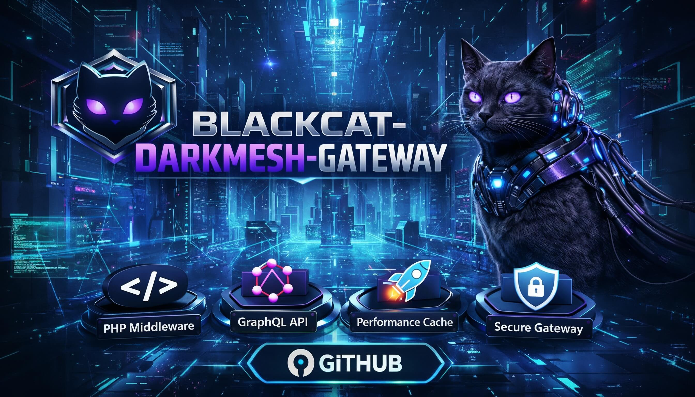

# Blackcat Darkmesh Gateway
[](https://github.com/users/Vito416/projects/2) [](https://github.com/Vito416/blackcat-darkmesh-gateway/actions/workflows/ci.yml) [](https://github.com/Vito416/blackcat-darkmesh-gateway/releases)



Purpose
- Universal edge/backend that serves many sites from web3 (Arweave templates) to web2 UX.
- Caches and serves trusted front-end bundles, proxies API calls to Write AO, AO (read), and Worker.
- Holds only time‑bounded encrypted envelopes needed to deliver emails/webhooks; never stores long‑term PII.
- Webhook ingress (Stripe/PayPal) with signature verification, optional HMAC secret, and metrics.

Key responsibilities
- Fetch + cache site front-end from Arweave (verified via manifest of trusted templates).
- API surface to browser: cart/checkout/session endpoints that forward to Write AO.
- PSP/webhook bridge: accept PSP callbacks, verify signature/cert, enqueue to Write AO; cache certs.
- Envelope cache: short TTL cache of encrypted PII blobs for async email/ops; wipe on expiry or ForgetSubject.
- Observability: expose metrics for cache hit/miss/expired, inbox rate-limit, webhook verify ok/fail, cert touches.
  - Replay visibility: `gateway_webhook_replay_total` increments on duplicate PSP deliveries (10m window by default).
  - DLQ/WAL from Write: dashboards/alerts consume `write.webhook.dlq_size` and `write.wal.bytes` to surface downstream backlog growth.
  - Suggested Grafana panels: cache hit/miss/expired rates, webhook verify fail/replay, PSP breaker open, cert pin/allow fails.

Data & privacy model
- PII stays encrypted at the edge; TTL cache only, bounded by Worker inbox TTL and merchant TTL.
- AO/Write hold only pseudonymous state (orders, inventory, idempotency, WAL) persisted to WeaveDB.
- Worker holds secrets (PSP keys, SMTP, OTP) and TTL inbox; Gateway never persists secrets.

Integration points
- To Worker: send inbox/notify; receive ForgetSubject → wipe gateway cache for subject.
- To Write AO: forward commands (CreateOrder, ProviderWebhook, IssueSession, etc.).
- To AO (read): serve catalog/public state to browser.

Runtime/tech
- Language/runtime TBD (edge-friendly). Must support:
  - TLS termination, header signing, HMAC verification.
  - Cert caching for PSP (e.g., PayPal).
  - Backoff/retry queues with jitter; circuit breaker per PSP endpoint.
  - Metrics exporter (Prometheus/OpenMetrics).

Configuration (per site)
- Arweave template txid + manifest (trusted templates list).
- Gateway cache TTL (<= Worker inbox TTL), max envelope size.
- PSP configs (keys, cert endpoints, webhook paths).
- Email/notify routing (via Worker notify).
- AO/Write endpoints + signing keys (if applicable).
- Env knobs:
- `GATEWAY_CACHE_TTL_MS`, `GATEWAY_RL_WINDOW_MS`, `GATEWAY_RL_MAX`
- `GATEWAY_WEBHOOK_REPLAY_TTL_MS`, `GATEWAY_WEBHOOK_SHADOW_INVALID` (return 202 instead of 401 on bad sig)
- `GATEWAY_FORGET_TOKEN` (auth for /cache/forget)
- `GW_CERT_CACHE_TTL_MS`, `GW_CERT_PIN_SHA256` (comma pins), `PAYPAL_CERT_ALLOW_PREFIXES` (comma prefixes)
- Notify → Worker:
  - `WORKER_NOTIFY_URL`, `WORKER_NOTIFY_TOKEN`, `WORKER_NOTIFY_HMAC`
- `WORKER_NOTIFY_BREAKER_KEY` (default) or per provider `WORKER_NOTIFY_BREAKER_KEY_STRIPE` / `..._PAYPAL` / `..._GOPAY`; forwarded as `x-breaker-key` to isolate breaker state per provider.
- Metrics scrape example (Prometheus):
  ```
  scrape_configs:
    - job_name: gateway
      static_configs:
        - targets: ["gateway.local:8787"]
      metrics_path: /metrics
      basic_auth:
        username: ${GATEWAY_METRICS_USER}
        password: ${GATEWAY_METRICS_PASS}
  ```

Security
- Never store plaintext PII; only encrypted blobs with TTL.
- Enforce HMAC/signature on inbox/notify/webhooks.
- ForgetSubject hook triggers cache purge; scheduled purge for expired items.

Flows (high level)
- **Page serve**: Browser → Gateway → (cache hit) serve template bundle; on miss pull from Arweave, verify manifest sig, cache with TTL, serve.
- **Checkout**: Browser → Gateway → Write AO (CreateOrder/PaymentIntent) → AO read state → Gateway → Browser; PSP webhook → Gateway → Write AO; AO updates streamed to browser.
- **Inbox/PII**: Browser encrypts with admin pubkey → Gateway caches encrypted blob (TTL) → Worker inbox (optional) → Admin pulls via Web console; ForgetSubject wipes gateway cache.
- **Notify**: Write AO event → Gateway → Worker /notify → email/webhook.

“Next-gen” capabilities (ideas)
- **Content integrity by default**: manifest with signed template hashes; automatic hash-pin of all assets; optional COOP/CSP headers locked to verified origins.
- **Smart cache policy**: per-merchant TTL, admission control (don’t cache oversized blobs), probabilistic early refresh for hot assets.
- **Active defense**: rate-limit buckets per route + device fingerprint, optional proof-of-work (Javascript/WASM) for bots, Geo/IP anomalies surfaced in metrics.
- **Chaos-safe PSP handling**: shadow mode for new PSP configs, replayable webhook fixtures, cert hot-reload without restart.
- **Zero-trust to Worker**: all payloads envelope-encrypted; Gateway never sees decrypted content; HMAC from Worker on responses to detect tampering.
- **Edge rendering toggle**: for low-latency sites, allow server-side render of cached templates with public state injected from AO; falls back to static.

Forward-looking / Quantum-ready
- Plan for hybrid PQC keys (e.g., X25519+Kyber for transport, Ed25519+Dilithium for signatures) once libraries are stable; keep manifest format extensible to multiple key types.
- Store template manifest with algorithm identifiers and key rotation schedule; Gateway can enforce “pqc_required=true” flag per merchant.
- Deterministic builds (reproducible templates) to make post-quantum verification simpler.

Open items to design/implement
- Exact endpoint contract with browser (cart/checkout/session).
- Metrics/alerts defaults (thresholds) and dashboard layout.
- Deployment topology (per-merchant vs multi-tenant isolation).
- PQC rollout playbook (hybrid, then switch), including browser support detection.

## Proposed component layout
- **Template Fetcher**: pulls Arweave bundles, verifies manifest sig, pins hash, stores in cache.
- **Cache/Envelope Store**: encrypted TTL cache with wipe scheduler, subject-index for ForgetSubject, metrics emit.
- **API Proxy**: forwards browser API calls to Write AO (auth, idempotency key propagation), injects public AO state.
- **PSP Bridge**: webhook ingress, signature/cert verify, retry/backoff queue, breaker per PSP, emits status to Write AO.
- **Metrics/Alerts Exporter**: Prometheus/OpenMetrics; supports scrape auth tokens (see `ops/alerts.md`).
- **Config Service**: per-merchant config (template txid, TTLs, PSP endpoints) hot-reloadable without restart.

## API surface (draft)
- `/api/cart/*`, `/api/checkout/*`, `/api/session/*` → proxied to Write AO.
- `/api/public/*` → served from AO read state (cached).
- `/webhook/:psp` → PSP bridge ingress.
- `/metrics` → Prom/OpenMetrics (protected, text format).
- `/cache/forget` → internal, called by AO ForgetSubject (token-protected).

## Security hardening (to implement)
- Strict CSP/COOP for served templates; SRI for all static assets.
- HMAC on browser→gateway API calls (optional) to deter tampering between CDN hops.
- mTLS / signed requests between Gateway↔Write AO/Worker where supported.
- Rate-limit buckets per IP + per session; PoW challenge toggle for abusive clients.

## Testing plan
- Unit: manifest verification, cache TTL/wipe, PSP signature verify.
- Integration: end-to-end checkout flow with fake PSP; webhook retries; cache wipe on ForgetSubject.
- Load: cache hit/miss ratios under concurrency; PSP breaker thresholds.
- Security: CSP/SRI enforcement tests; replay attacks for webhooks; envelope tamper tests.

### Quick test commands
- Unit + integration: `npm test`
- Metrics auth smoke: `npm test -- --run tests/metrics-auth.test.ts`
- Webhook pen-tests: `npm test -- --run tests/webhook-pentest.test.ts`
- Bez lokálního Node: `docker run --rm -v $(pwd):/app -w /app node:20-alpine sh -c "npm ci && npm test -- --run tests/webhook-pentest.test.ts"`

## Releases
- Release drafts are created from main; see the latest draft and published tags in [Releases](https://github.com/Vito416/blackcat-darkmesh-gateway/releases).
Open items to design/implement
- Exact endpoint contract with browser (cart/checkout/session).
- Metrics/alerts defaults (thresholds).
- Deployment topology (per-merchant vs multi-tenant isolation).
