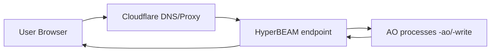
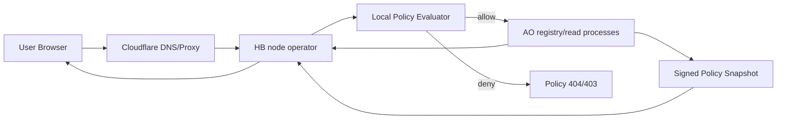
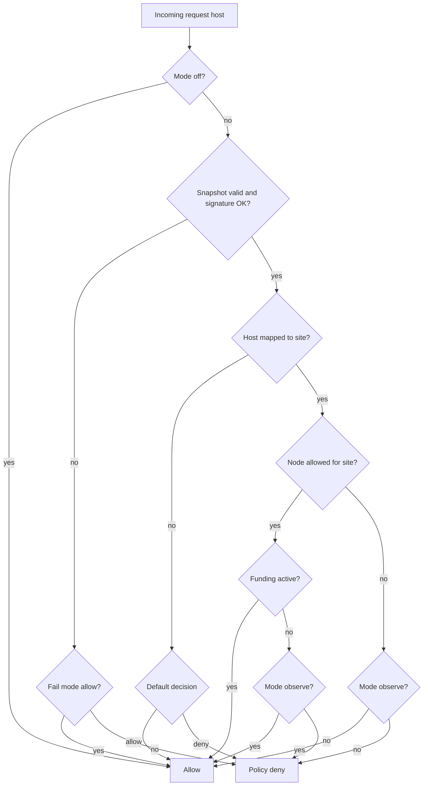

# Darkmesh HB Access and Reward Policy Spec v1 (non-disruptive)

Date: 2026-04-21  
Status: Draft spec (design only, no runtime change yet)

## 1) Why this exists

Darkmesh needs a future-proof model where:

- operators can run stock HyperBEAM nodes,
- site access can be policy-driven (funding/contribution aware),
- rewards can be distributed from a Darkmesh pool,
- current production traffic and current HB rewards are not disrupted.

This document defines a rollout-safe architecture and data model.

## 2) Hard requirements

1. **No impact on current runtime now**
   - No behavior change unless explicit feature flags are enabled.
2. **No loss of current rewards**
   - Existing HyperBEAM node continues serving as today.
3. **Stock HyperBEAM compatibility**
   - No required HB core fork.
   - Use configuration and optional Lua/device hooks only.
4. **Fail-safe rollout**
   - Early phases must be fail-open (`allow`) to avoid accidental traffic loss.
5. **On-chain source of truth**
   - AO keeps canonical policy state and signed snapshots.
6. **Low latency at edge**
   - HB evaluates local cached snapshot, not chain per request.

## 3) Non-goals (v1)

- Real-time per-request on-chain lookup.
- Replacing Cloudflare DNS/edge routing in this phase.
- Rebuilding payout treasury logic in this repo (only interface contract is specified).

## 4) Current baseline (today)



Current behavior is host-based routing + AO reads/writes without contribution-based gating.

## 5) Target architecture (future)

### 5.1 High-level flow



### 5.2 Important point

Policy check happens on HB from a signed cached snapshot. AO is canonical authority, HB is fast decision engine.

## 6) Rollout principle: zero disruption first

Policy enforcement must be phased by explicit mode:

- `off` -> no policy gating, fully current behavior.
- `observe` -> evaluate policy but never block.
- `soft` -> block only explicit deny + emit fallback telemetry.
- `enforce` -> strict policy decision.

Default for all existing nodes/sites in v1 start: `off`.

## 7) Data model (canonical AO state)

## 7.1 Entities

- **NodeProfile**: operator node identity + capabilities.
- **SitePolicy**: which nodes may serve which site/domain.
- **ContributionState**: pool contribution status per site/operator.
- **PolicySnapshot**: signed immutable decision dataset consumed by HB.

## 7.2 Suggested JSON schema shape (snapshot)

```json
{
  "version": 1,
  "snapshotId": "snap_2026_04_21T09_00_00Z",
  "generatedAt": "2026-04-21T09:00:00Z",
  "validUntil": "2026-04-21T09:05:00Z",
  "policyMode": "observe",
  "defaultDecision": "allow",
  "nodes": {
    "node_wallet_addr_1": {
      "status": "online",
      "regions": ["eu-central"],
      "labels": ["darkmesh-pool"]
    }
  },
  "sites": {
    "site-demo-001": {
      "domains": ["example.com", "www.example.com"],
      "accessModel": "allowlist",
      "allowedNodes": ["node_wallet_addr_1"],
      "fundingState": "active"
    }
  },
  "domainToSite": {
    "example.com": "site-demo-001",
    "www.example.com": "site-demo-001"
  },
  "signature": {
    "alg": "ed25519",
    "keyId": "policy-root-2026-q2",
    "value": "base64_signature"
  }
}
```

## 8) AO contract extensions (proposed)

These are proposed AO actions (read/write split still respected):

### 8.1 Write/admin actions

- `RegisterHBNode`
- `UpdateHBNodeStatus`
- `SetSiteServingPolicy`
- `SetSiteFundingState`
- `SetPolicyMode`
- `PublishPolicySnapshot`
- `RevokePolicySnapshot`

### 8.2 Read/public/operator actions

- `GetPolicySnapshot` (by id/latest)
- `GetDecisionForHostNode` (debug/validation path)
- `GetSiteServingPolicy`
- `GetHBNodeProfile`

## 9) HB-side evaluator behavior

## 9.1 Inputs

- request host,
- local node identity (`nodeWallet`),
- cached signed snapshot,
- local runtime mode (`off|observe|soft|enforce`).

## 9.2 Decision logic



## 10) Config contract (operator-facing)

Proposed env keys with safe defaults:

- `DM_POLICY_MODE=off`
- `DM_POLICY_SOURCE=none` (none|ao-snapshot|static-file)
- `DM_POLICY_SNAPSHOT_URL=`
- `DM_POLICY_SNAPSHOT_REFRESH_SEC=30`
- `DM_POLICY_FAIL_MODE=allow`
- `DM_POLICY_DEFAULT_DECISION=allow`
- `DM_POLICY_NODE_ID=<wallet-address>`
- `DM_POLICY_CACHE_MAX_AGE_SEC=300`

Safe default profile for existing nodes:

```env
DM_POLICY_MODE=off
DM_POLICY_SOURCE=none
DM_POLICY_FAIL_MODE=allow
DM_POLICY_DEFAULT_DECISION=allow
```

This preserves current behavior exactly.

## 11) Compatibility with current deployment

No active behavior change is needed for:

- `hyperbeam.darkmesh.fun` public endpoint,
- current Cloudflare DNS setup,
- AO route resolution currently in place,
- current HB reward participation.

Policy stack can be introduced in shadow mode (`observe`) only after metrics baseline is stable.

## 12) Security model

### 12.1 Trust boundaries

- AO policy state/signatures: trusted source.
- HB node operator runtime: untrusted but constrained by signed policy.
- Browser/client: untrusted input.

### 12.2 Anti-abuse

- Signature verify every snapshot update.
- Snapshot TTL + monotonic version checks.
- Replay guard (reject older snapshot versions).
- Optional deny on signature mismatch when mode >= `soft`.

## 13) Reward fairness model (interface only)

Payout engine can consume the same canonical snapshot and usage evidence.

Required evidence classes (v1 interface):

- node uptime/health windows,
- policy-compliant served request counts,
- optional weighted contribution metrics (latency class, region demand).

Do not tie payout directly to self-reported counters without cross-check.

## 14) Observability and alerts

Minimum metrics to add before enforcement:

- `darkmesh_policy_decision_total{decision,mode,reason}`
- `darkmesh_policy_snapshot_age_seconds`
- `darkmesh_policy_snapshot_verify_fail_total`
- `darkmesh_policy_fallback_total{fallback_reason}`
- `darkmesh_policy_host_unmapped_total`

Alert suggestions:

- Snapshot stale (`age > 2 x refresh interval`) in mode != off.
- Signature failures above threshold.
- Sudden deny spike after policy rollout.

## 15) Test matrix (must pass before soft/enforce)

1. **off mode parity**
   - Same responses as current production baseline.
2. **observe mode parity**
   - Same responses + metrics only.
3. **signature invalid snapshot**
   - fallback path works as configured.
4. **host mapped + allowed node + funded**
   - allow.
5. **host mapped + disallowed node**
   - observe: allow + metric, enforce: deny.
6. **host unmapped**
   - default decision path deterministic.

## 16) Rollout plan (no reward risk)

### Phase 0 - Spec + telemetry prep (now)

- Add schemas/actions in AO behind no-op defaults.
- Add evaluator code path disabled by default.

### Phase 1 - Observe only

- Enable `DM_POLICY_MODE=observe` for selected test nodes/sites.
- Collect metrics for 7-14 days.

### Phase 2 - Soft gating for opt-in sites only

- `DM_POLICY_MODE=soft` on selected sites.
- Keep global default `allow`.

### Phase 3 - Enforce for pool-funded tier

- Enforce only where site explicitly opts into funded policy tier.
- Keep legacy/public tier available.

## 17) Rollback strategy

Immediate rollback knobs:

1. Set `DM_POLICY_MODE=off` (node-side).
2. Publish AO policy snapshot with `defaultDecision=allow`.
3. Revert to previously signed stable snapshot id.

All three options must preserve current traffic without restart-heavy recovery.

## 18) Repository implementation split (proposed)

- `blackcat-darkmesh-ao`
  - canonical policy state/actions/snapshot signing.
- `blackcat-darkmesh-write`
  - admin mutation pathways for policy updates.
- `blackcat-darkmesh-gateway`
  - operator runbook, policy-evaluator integration contract, smoke/deep tests.
- `blackcat-darkmesh-web`
  - optional admin UI controls for site-level policy tier selection.

## 19) Open decisions to finalize

1. strict deny code for policy block (`403` vs masked `404`).
2. minimum snapshot refresh interval for low-end nodes.
3. payout formula weights (uptime vs served traffic vs latency class).
4. whether funded policy tier is mandatory for all ecommerce sites or opt-in only.

---

## Appendix A: non-disruptive guarantee checklist

Before enabling any mode above `off`:

- [ ] current HB endpoint health stable for >=24h
- [ ] snapshot signing keys rotated and backed up
- [ ] observe-mode parity test pass
- [ ] rollback command tested on at least one node
- [ ] no measurable drop in current reward participation metrics

If any item fails, keep `DM_POLICY_MODE=off`.
