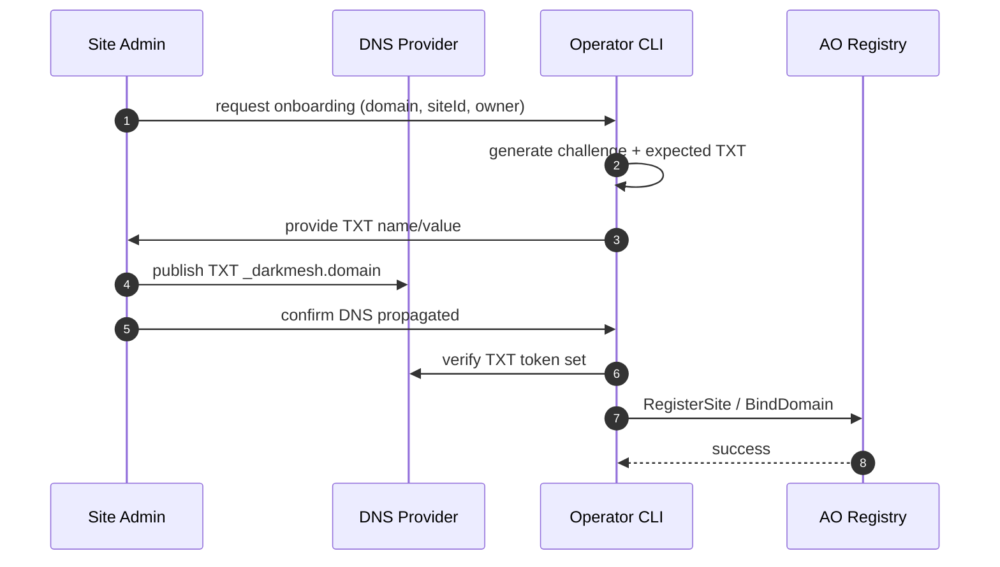

# Darkmesh DNS proof onboarding spec v1

Date: 2026-04-21  
Status: Draft (onboarding-time verification only)

## 1) Goal

Provide a simple ownership proof for domain onboarding, without adding heavy runtime dependency or worker hot-path load.

This spec is intentionally:

- cheap (works on free DNS plans),
- deterministic,
- compatible with current HyperBEAM-first serving model.

## 2) Scope (what it is / what it is not)

This DNS proof is:

- used when onboarding or re-validating a domain,
- used before AO control-plane writes (`BindDomain`),
- used periodically by operators for drift checks.

This DNS proof is **not**:

- evaluated on every user request,
- a replacement for runtime signatures,
- a dynamic paywall policy engine.

## 3) TXT record format

TXT name:

`_darkmesh.<domain>`

TXT value (v1):

`v=dm1;site=<site_id>;owner=<wallet_address>;challenge=<random>;issued=<iso8601>;expires=<iso8601>`

Required fields:

- `v=dm1`
- `site`
- `owner`
- `challenge`

Recommended fields:

- `issued`
- `expires`

## 4) Onboarding flow



## 5) Security model

Strengths:

- prevents accidental or unauthorized host claims,
- gives auditable onboarding evidence,
- does not increase request-time attack surface.

Known limits:

- DNS account compromise can forge proof,
- no per-request policy decision from this record,
- does not replace AO role/signature controls.

## 6) Operational guidance

- Keep verification in CI/operator tooling, not runtime data plane.
- Use short-lived challenge values for onboarding sessions.
- Re-run proof check before critical domain remapping.
- Prefer DNSSEC-enabled zones when available.

## 7) CLI reference (v1)

Helper script:

`ops/live-vps/local-tools/dns-proof-cli.sh`

Generate:

```bash
bash ops/live-vps/local-tools/dns-proof-cli.sh generate \
  --domain jdwt.fun \
  --site-id site-jdwt \
  --owner <wallet_address>
```

Verify:

```bash
bash ops/live-vps/local-tools/dns-proof-cli.sh verify \
  --domain jdwt.fun \
  --site-id site-jdwt \
  --owner <wallet_address> \
  --challenge <challenge_from_generate>
```

## 8) Future evolution (v2+ candidates)

- signed TXT payload (`sig=<...>`) bound to site-owner wallet,
- optional AO-published proof snapshot pointer,
- policy-tier linkage for paid/pool eligibility checks.

v1 stays intentionally minimal to avoid disrupting current production routing.

