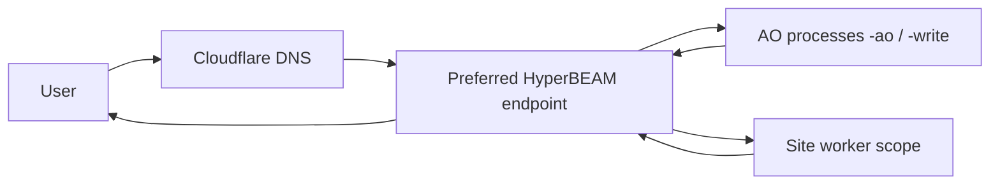
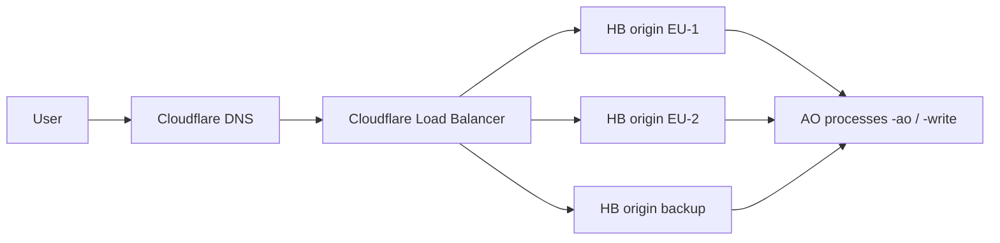

# HB traffic model: no LB vs. CF Load Balancer

Date: 2026-04-21  
Scope: `blackcat-darkmesh` gateway model (HB as universal runtime), DNS via Cloudflare.

## 1) Goal

Use one unified operating model:

- **default (low cost)**: without Cloudflare Load Balancer (LB), suitable for most websites and ecommerce stores,
- **premium (resilient)**: with Cloudflare LB for critical websites that require higher availability.

## 2) Option A: without CF LB (default for most sites)

Point the domain to **one preferred HB endpoint**.

### Request flow

### What this means in practice

- Simple and low-cost configuration.
- No LB add-on required.
- **Risk**: the preferred HB is a single point of entry for that domain.
- If the HB endpoint is down or overloaded, the site can be unavailable until manual DNS/config changes are made.

## 3) Option B: with CF Load Balancer (for important projects)

Point the domain to an LB hostname with multiple HB origins (pool).

### Request flow

### What this means in practice

- Health checks and automatic failover.
- Better resilience when one HB endpoint fails.
- Better load distribution for important domains.
- Higher cost (LB add-on) and higher operational complexity.

## 4) Practical decision rule

- **Without LB**:
  - low-cost sites,
  - lower SLA,
  - no need for immediate failover.
- **With LB**:
  - critical websites/ecommerce,
  - higher SLA,
  - sensitivity to outages or traffic spikes.

## 5) Project architecture note

- HB remains **stock** (no core-code fork).
- AO (`-ao`, `-write`) is the source of truth for site data and orchestration.
- Worker remains a lightweight trust layer (signing/secrets scope).
- The main difference between basic and premium operation is the **entry layer (DNS/LB)**, not core app logic.

## 6) Risk summary

| Mode | Cost | Complexity | Resilience |
|---|---:|---:|---:|
| Without LB | low | low | medium-low |
| With CF LB | higher | medium | high |

Recommended rollout:

1. Start without LB (fast start, low cost),
2. monitor traffic and incidents,
3. enable CF LB on selected domains and switch them to premium mode.

