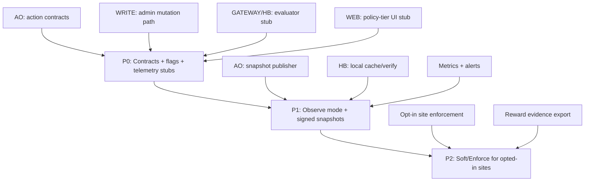

# Darkmesh policy implementation checklist (P0 -> P2)

Date: 2026-04-21  
Status: Implementation checklist (derived from `ops/live-vps/DARKMESH_HB_POLICY_SPEC_V1.md`)

## 1) Objective

Implement policy-aware HB serving and reward-pool eligibility in a future-proof way, **without changing current live behavior** until we explicitly opt in.

## 2) Non-disruption guardrails (mandatory)

- Default mode everywhere: `DM_POLICY_MODE=off`.
- Default fallback: `DM_POLICY_FAIL_MODE=allow`.
- No rollout step can remove current domain-serving path.
- Every phase must pass parity checks vs current production behavior.
- Rollback to `off` must be one-command and restart-safe.

## 3) Dependency graph



## 4) Phase matrix

| Phase | Runtime effect | Target |
|---|---|---|
| P0 | none (strict no-op) | Land contracts, env flags, tests, docs |
| P1 | observe-only | Shadow decisions and telemetry, no blocking |
| P2 | opt-in gating | Soft/enforce only for enrolled sites/operators |

## 5) Work breakdown by repository

## 5.1 `blackcat-darkmesh-ao`

### P0

- [ ] **AO-P0-01** Add policy data schema docs (`NodeProfile`, `SitePolicy`, `ContributionState`, `PolicySnapshot`).
- [ ] **AO-P0-02** Add read actions (contract-only, no enforcement effect):
  - `GetPolicySnapshot`
  - `GetSiteServingPolicy`
  - `GetHBNodeProfile`
  - `GetDecisionForHostNode` (must return `allow` under global `off`).
- [ ] **AO-P0-03** Add write/admin actions behind role gate (`admin`/`registry-admin`):
  - `RegisterHBNode`
  - `UpdateHBNodeStatus`
  - `SetSiteServingPolicy`
  - `SetSiteFundingState`
  - `SetPolicyMode`
  - `PublishPolicySnapshot`
  - `RevokePolicySnapshot`
- [ ] **AO-P0-04** Add contract tests proving parity with current host resolution when mode is `off`.

### P1

- [ ] **AO-P1-01** Implement signed snapshot publication and monotonic versioning.
- [ ] **AO-P1-02** Add freshness/expiry fields and replay guard semantics.
- [ ] **AO-P1-03** Add strict envelope tests for snapshot and decision reads.

### P2

- [ ] **AO-P2-01** Add explicit policy deny reasons and deterministic error mapping.
- [ ] **AO-P2-02** Add reward-evidence read/export interfaces (policy-compliant usage basis).

## 5.2 `blackcat-darkmesh-write`

### P0

- [ ] **WR-P0-01** Add admin mutation commands for new AO policy writes.
- [ ] **WR-P0-02** Enforce signer/role policy for all policy-mutating actions.
- [ ] **WR-P0-03** Add idempotency tests for policy updates (`Request-Id` reuse).

### P1

- [ ] **WR-P1-01** Add snapshot publish helper (sign + publish + AO register pointer).
- [ ] **WR-P1-02** Add rollback helper to pin previous snapshot id quickly.

### P2

- [ ] **WR-P2-01** Add payout-evidence packaging pipeline (signed export bundle).

## 5.3 `blackcat-darkmesh-gateway`

### P0

- [ ] **GW-P0-01** Add evaluator interface (disabled path, no request impact).
- [ ] **GW-P0-02** Add env flags with safe defaults:
  - `DM_POLICY_MODE=off`
  - `DM_POLICY_SOURCE=none`
  - `DM_POLICY_FAIL_MODE=allow`
  - `DM_POLICY_DEFAULT_DECISION=allow`
- [ ] **GW-P0-03** Add parity tests: mode `off` response equivalence for mapped/unmapped hosts.

### P1

- [ ] **GW-P1-01** Implement local snapshot cache + signature verify pipeline.
- [ ] **GW-P1-02** Enable `observe` mode path (emit metrics, never block).
- [ ] **GW-P1-03** Add alerts/dashboards for snapshot staleness + deny deltas.

### P2

- [ ] **GW-P2-01** Enable `soft` for selected domains/sites.
- [ ] **GW-P2-02** Enable `enforce` only for explicit opt-in funded tier.
- [ ] **GW-P2-03** Add operator runbook for emergency mode reset to `off`.

## 5.4 `blackcat-darkmesh-web`

### P0

- [ ] **WEB-P0-01** Add policy-tier data model in admin config (no runtime enforcement).
- [ ] **WEB-P0-02** Add UI labels/warnings (`off`, `observe`, `soft`, `enforce`).

### P1

- [ ] **WEB-P1-01** Add snapshot status view (fresh/stale/signature state).

### P2

- [ ] **WEB-P2-01** Add opt-in enrollment workflow for funded policy tier.
- [ ] **WEB-P2-02** Add safe rollback UI action (`set mode off`).

## 6) Acceptance gates per phase

## P0 gate (must pass before any observe rollout)

- [ ] Existing live smoke/deep suite passes unchanged.
- [ ] New policy actions respond deterministically with strict envelopes.
- [ ] Mode `off` parity suite passes for host resolution and rendering paths.
- [ ] Rollback command documented and tested (even though no enforcement yet).

## P1 gate (must pass before soft mode)

- [ ] Observe metrics stable for at least 7 days on test set.
- [ ] No measurable drop in success rate/latency vs pre-policy baseline.
- [ ] Snapshot verify failures are alerting and operationally handled.

## P2 gate (must pass before enforce expansion)

- [ ] Soft mode proven on opted-in test domains with no critical regressions.
- [ ] Enforce mode proven on canary group.
- [ ] Payout evidence export verified and reproducible.

## 7) Suggested command set for verification

Gateway:

```bash
cd blackcat-darkmesh-gateway
npm test
npm run ops:audit-all
bash ops/live-vps/local-tools/demo-domain-smoke.sh --domains-file ops/live-vps/local-tools/demo-domains.example.txt
```

AO:

```bash
cd blackcat-darkmesh-ao
scripts/verify/preflight.sh
lua scripts/verify/contracts.lua
```

Write:

```bash
cd blackcat-darkmesh-write
bash scripts/verify/preflight.sh
lua5.4 scripts/verify/action_validation.lua
```

## 8) Rollback quick card

If any policy rollout causes degradation:

1. Set evaluator mode to off (`DM_POLICY_MODE=off`).
2. Keep `DM_POLICY_FAIL_MODE=allow`.
3. Restart edge runtime.
4. Re-run smoke checks.

This must restore current behavior without requiring AO state surgery.

## 9) Notes

- This checklist intentionally separates contract landing (P0) from behavior change (P1/P2).
- No enforcement should run until observe telemetry proves parity and stability.

## 10) HB parity deep diagnosis (2026-04-21)

Status: read parity is OK, control-plane parity is NOT yet complete.

### Evidence

1) Full parity gate result on primary HB endpoint:
- `ops/live-vps/local-tools/hb-full-parity-gate.sh`
- result:
  - read: `200` (`/~meta@1.0/info`)
  - scheduler write: `500 process_not_available`
- artifacts:
  - `tmp/hb-full-parity-gate-20260421T121136Z/`

2) Same PID on public push scheduler:
- `send_ans104_scheduler.js --url https://push.forward.computer ...`
- result: `200`, `slot` present, `process` header present.
- artifact:
  - `tmp/push-scheduler-check-20260421T121856Z.json`

3) Process scheduler tag mismatch vs local HB identity:
- PID: `tIItgtKIdmozH0pk_-N6IWr-1cFHYObijGAp0J4ZDtU`
- on-chain `Scheduler` tag: `n_XZJhUnmldNFo4dhajoPZWhBXuJk-OcQr5JQ49c4Zo`
- local HB `address` header (`/~meta@1.0/info`): `_wCF37G9t-xfJuYZqc6JXI9VrG4dzM5WUFgDfOn9LdM`
- conclusion: current registry PID is owned by different scheduler than local HB.

4) Local HB mode/config indicators from `~meta`:
- `only: local`
- service env was hardened to parity profile:
  - `load_remote_devices: true`
  - `arweave_index_blocks: true`
  - explicit routes for `/graphql`, `/<43-char-id>`, `/tx/<43-char-id>`
- implication: basic parity knobs are now enabled, but spawn parity still fails due unresolved linked messages (see item 8).

5) HB logs confirm failure is inside scheduler resolution:
- `dev_scheduler:find_process_message/4`
- error details: `{process_not_available,<<"tIIt...">>}`
- this is application-level scheduler lookup failure, not TLS/cloudflared transport failure.

6) Fresh WASM rebuild + republish + respawn attempt on local HB still fails (2026-04-21):
- rebuilt module via docker:
  - `scripts/deploy/rebuild_wasm_from_runtime.sh registry`
- published module:
  - tx: `TrNj8CSFaevoYSAsnxuQ97SkdDuPvpkgxR-L6i3QCzY`
  - module fetch on local HB returns `200` (`/<tx>~module@1.0?accept-bundle=true`)
- spawn attempt on local HB with local scheduler `_wCF...`:
  - `spawn_process_wasm_tn.mjs ... --url https://hyperbeam.darkmesh.fun --scheduler _wCF...`
  - failure: `spawn_failed ... scheduler_timeout`
  - HB logs: `necessary_message_not_found` on commitment body link (`qZFH...`) during local schedule.
- spawn attempt on local HB with push scheduler `n_XZ...`:
  - failure: `500`
  - HB logs: `no_viable_route` for GraphQL lookup (`POST /graphql`) while resolving `Scheduler-Location`.
  - indicates missing route/config capability for remote scheduler discovery on this node.

7) Runtime config asymmetry found in live container:
- generated `/app/config.json` now contains:
  - `^/arweave -> http://127.0.0.1:1984`
  - `^/graphql$ -> https://arweave.net`
  - `^/[A-Za-z0-9_-]{43}$ -> https://arweave.net`
  - `^/tx/[A-Za-z0-9_-]{43}$ -> https://arweave.net`
- parity result still fails on control-plane spawn despite this config.

8) Additional deep diagnosis (post-config hardening, 2026-04-21):
- failing links seen in HB errors are not resolvable via Arweave GraphQL as transactions:
  - `tPamSmqSzPadV8vmJmKF7AT2ax8rTlgW9ZeAsDyiauM` -> `{"data":{"transaction":null}}`
  - `qIOTYi5xQ802WdpmTtmaXoRI_y4U07eb8LUb_0_BQqc` -> `{"data":{"transaction":null}}`
- local HB still emits:
  - `necessary_message_not_found ... Link: tPam...`
  - `necessary_message_not_found ... Link: qIOT...`
- effect:
  - module fetch is OK (`/<module-tx>~module@1.0?accept-bundle=true` => `200`)
  - spawn still fails (`POST /push` => `500`) even when using push scheduler tag on local endpoint.
- interpretation:
  - this is not only scheduler-tag mismatch anymore; unresolved linked-message retrieval in current runtime path remains a blocking issue for full control-plane parity.

9) Direct no-Cloudflare verification (2026-04-21):
- tested directly on node loopback over Tailscale SSH:
  - `http://127.0.0.1:8734/~meta@1.0/info` -> `200`
  - `http://127.0.0.1:8734/~scheduler@1.0/slot/current?target=pv5L9...` -> `500`
  - `http://127.0.0.1:8734/pv5L9...` -> `404`
- direct local spawn retry (`/push`, local scheduler `_wCF...`) still fails:
  - `scheduler_timeout`
  - nested error: `necessary_message_not_found` for commitment `body` links (e.g. `bf7Fg...`, `a6hKO...`, `ZQe8J...`)
- conclusion:
  - Cloudflare tunnel is not the primary blocker for control-plane parity.
  - primary blocker is inside current HB runtime/control-plane path on this node.

### Root cause statement

Primary cause:
- control-plane writes target a PID whose scheduler is `n_XZ...` (push scheduler), while current HB node runs with local scheduler identity `_wCF...` and local-only resolution settings.

Secondary cause:
- catch-all demo host path through nginx (`127.0.0.1:8744`) can still emit `upstream sent invalid header` on scheduler/error responses; this path is suitable for demo read UX, not control-plane writes.

Tertiary cause (new, parity-critical):
- even after route/discovery/index hardening, local HB still cannot resolve specific linked messages required by scheduler flow (`necessary_message_not_found`), causing `POST /push` to fail with `500`.

### Operational rule (now)

- Use `https://hyperbeam.darkmesh.fun` for read and control-plane transport checks.
- Keep `push`/`push1` fallback for control-plane writes until registry PID is moved/re-spawned under local scheduler or scheduler-compat mode is introduced.
- Do not send scheduler writes to demo domains (`jdwt.fun`, `vddl.fun`, `blgateway.fun`).

### Required closure tasks (to remove push fallback)

- [ ] Confirm upstream-supported retrieval path for linked messages used by scheduler flow (`tPam...`, `qIOT...`) on self-hosted HB runtime.
- [ ] If needed, align runtime profile with known-good public node behavior (scheduler/client modules + fetch path), then re-test spawn.
- [ ] Spawn/register darkmesh AO registry PID with scheduler equal to local HB identity (`_wCF...`) and migrate bindings.
- [ ] Re-run parity gate; require `2xx` + `slot/process` headers on local HB endpoint.
- [ ] Keep demo-domain catch-all for read onboarding only, not scheduler write path.

## 11) Error-string-first diagnosis (no transport test path)

This section isolates the core blocker from the scheduler error chain itself,
without requiring additional ingress/transport A/B tests.

### Exact error chain (from HB logs)

1) first throw:
- `necessary_message_not_found, <<"body">>, "Link (to link): <ID>"`
- examples: `bf7Fg...`, `a6hKO...`, `ZQe8J...`, `qIOT...`

2) throw origin stack:
- `hb_cache:report_ensure_loaded_not_found/3` (`/app/src/hb_cache.erl:150`)
- `hb_cache:ensure_all_loaded/3` (`/app/src/hb_cache.erl:167`)
- `dev_codec_httpsig_conv:to/4` (`/app/src/dev_codec_httpsig_conv.erl:378`)
- `hb_http:prepare_request/6` -> `hb_http:post/4` -> `hb_client:upload/2`
- caller path: `dev_scheduler:post_local_schedule/4`

3) top-level API error returned to client:
- `returning_500_error, method: POST, path: /push`
- `Error details: {scheduler_timeout, ...}`

Interpretation:
- `scheduler_timeout` is a downstream symptom.
- root throw is `necessary_message_not_found` for required commitment `body` link material.

### Why this matters

The failing IDs are not normal Arweave transaction IDs in this flow; they are
internal linked message references that must be resolvable from node store/cache
when the request is encoded for upload (`ensure_all_loaded` path).

### Config-level risk discovered

Current generated HB runtime config (`ops/live-vps/runtime/hb/entrypoint.sh`) uses
a highly reduced store graph:
- only `hb_store_arweave` with `access: ["read"]`
- nested lmdb index store
- no explicit general local read/write primary store chain equivalent to stock defaults.

Working hypothesis:
- scheduler/upload path needs local writable + resolvable message material chain for linked
  commitment bodies;
- reduced store graph can leave these links unresolved at encode/upload time, producing
  `necessary_message_not_found`.

Mitigation prepared (code-level, no HB source edits):
- `ops/live-vps/runtime/hb/entrypoint.sh` now generates a fuller store graph:
  - explicit primary `hb_store_lmdb` (`${DATA_DIR}/lmdb`)
  - local `hb_store_fs` (`${DATA_DIR}/fs-mainnet`)
  - remote `hb_store_arweave` + lmdb index
  - gateway stores (`hb_store_gateway`) with local-store bindings
- purpose: restore runtime store parity closer to stock HB defaults while keeping custom routes.

### Practical consequence

Until store/profile parity with known-good public nodes is restored, local node can look
healthy for read endpoints yet still fail control-plane spawn/schedule with `500`.

## 12) Re-test outcome after scheduler+ingress alignment (2026-04-21)

Applied:
- local-scheduler spawn path uses HB identity scheduler:
  - `_wCF37G9t-xfJuYZqc6JXI9VrG4dzM5WUFgDfOn9LdM`
- cloudflared `hyperbeam.darkmesh.fun` route normalized with:
  - `originRequest.httpHostHeader: 127.0.0.1`

Observed:
- new spawn via public HB endpoint succeeded:
  - PID: `l_0YGt3W5KBM2kVHa9uEz8yFmbU_wj-D3rR4Ez-xVzo`
  - status: `200`
- scheduler direct message send on that PID succeeded:
  - status: `200`
  - slot: `1`

Important:
- older PIDs tied to push scheduler (`n_XZ...`) still fail local slot reads with:
  - `No location found for address: n_XZ...`
- this is expected until those PIDs are migrated/re-bound to local scheduler.

## 13) Deep runtime audit checkpoint (2026-04-21)

### Applied adjustment

- Cloudflared ingress for `hyperbeam.darkmesh.fun` now targets local nginx loopback:
  - `service: http://127.0.0.1:8744`
  - `originRequest.httpHostHeader: 127.0.0.1`
- This restores stable root behavior (`302` to `~meta`) and removes healthcheck false-negatives.

### Validation summary

- Domain smoke pass:
  - `jdwt.fun`, `vddl.fun`, `blgateway.fun`, `hyperbeam.darkmesh.fun`
- Parity gate pass (read + signed scheduler send):
  - `status=200`, `slot` and `process` headers present
- Healthcheck timer/service:
  - latest run = `HEALTHCHECK PASS`

### Hidden/exposed runtime surfaces found

- Publicly reachable:
  - `~cron@1.0/*` (including `every`)
  - `~copycat@1.0/info`
- Risk:
  - possible remote scheduling/abuse surface if left unrestricted.
- Required hardening follow-up:
  - add explicit allow/deny policy on cron/copycat mutation paths (default deny for public traffic),
  - keep this as P1 policy debt before strict production declaration.

## 14) NASA visibility + route diagnostics (2026-04-21)

### Confirmed now

- Node is present in NASA routes state:
  - address: `_wCF37G9t-xfJuYZqc6JXI9VrG4dzM5WUFgDfOn9LdM`
  - `prefix`: `https://hyperbeam.darkmesh.fun`
  - `peers`: `https://arweave.darkmesh.fun`
  - `successcount`: `0` (at check time)
- Stake state is valid:
  - `required-stake` = `25000000000000`
  - `balances/<wallet>` = `25000000000000`

### Current blocker found

- Control-plane reads for process state on self-hosted HB still fail in local path with:
  - `{no_viable_route,{reason,no_matches},...}`
- Failure stack centers on:
  - `hb_http:request/2 -> dev_relay:call/3 -> dev_delegated_compute -> dev_genesis_wasm`
- Missing route observed in error payload:
  - `path = /result/0?process-id=<pid>`

### Practical interpretation

- This is not a stake registration failure.
- This is runtime routing parity debt for delegated compute/result retrieval.
- Rewards dashboard visibility and stake registration can be healthy while this compute-route debt remains.

### Temporary operating posture

- Keep NASA participation active with current registered endpoints.
- Keep `REMOTE_GATEWAY=https://arweave.net` for data availability.
- Do not tighten policy/allowlist gates yet (to avoid reducing reward eligibility during alpha).

## 15) Spawn re-test + bottleneck audit snapshot (2026-04-21)

Scope requested:
- re-test spawn path now,
- verify operational health (errors + bottleneck signs),
- confirm whether parity is fully clean.

### Re-test results

Parity gate:
- command: `ops/live-vps/local-tools/hb-full-parity-gate.sh`
- status: `PASS`
- artifact: `tmp/hb-full-parity-gate-20260421T182942Z/`

Spawn (default public HB URL):
- command:
  - `node scripts/deploy/spawn_process_wasm_tn.mjs --url https://hyperbeam.darkmesh.fun ...`
- result:
  - `module_not_ready` (`status=500`) on:
    - `https://hyperbeam.darkmesh.fun/TrNj8CSFaevoYSAsnxuQ97SkdDuPvpkgxR-L6i3QCzY~module@1.0?accept-bundle=true`
  - disabling module wait still fails spawn parse path (`/push` response is HTML doc payload, PID missing).

Spawn (device-qualified URL workaround):
- command:
  - `node scripts/deploy/spawn_process_wasm_tn.mjs --url https://hyperbeam.darkmesh.fun/~process@1.0/ --wait-module 0 ...`
- result:
  - success (`status=200`)
  - new PID: `u9o5qKGwgbZKFoMbmVguwS4nSGd-ZenptA8qVOjrjBQ`
  - scheduler ping on new PID: `status=200`, `slot=1`

### Runtime audit summary

Domain smoke:
- pass for: `jdwt.fun`, `vddl.fun`, `blgateway.fun`, `hyperbeam.darkmesh.fun`.

Public endpoint status sample:
- root: `https://hyperbeam.darkmesh.fun/` => `200` (manifest payload),
- meta bundle: `~meta@1.0/info?accept-bundle=true` => `200`,
- module fetch (plain host path): `<module>~module@1.0?accept-bundle=true` => `500` (`device_not_loadable/module_not_admissable`).

Process readback:
- scheduler slot endpoint works:
  - `~scheduler@1.0/slot?target=<pid>` => `200` (`current=9` observed),
- compute/result read path still not healthy:
  - `/<pid>/now?...` => `404 not_found`,
  - `/result/<slot>?process-id=<pid>` => `404 not_found`.

Latency snapshot:
- artifact: `tmp/hb-audit-20260421T183843Z.txt`
  - root p50 ~`0.204s` (p95 ~`0.243s`)
  - meta p50 ~`0.443s` (p95 ~`0.471s`)
  - arweave info p50 ~`0.124s` (p95 ~`0.170s`)
- scheduler signed ping loop artifact:
  - `tmp/scheduler-ping-latency-20260421T184006Z.txt`
  - `n=8`, avg `12486ms`, min `11290ms`, max `13394ms`

### Audit conclusion (current)

- Spawn is **operational with workaround URL** (`/~process@1.0/`), but **not clean on default host path**.
- Read-plane parity for process compute/result is still incomplete (`now`/`result` 404).
- Main bottleneck sign today is control-plane roundtrip latency (~11-13s per signed scheduler ping), not edge HTTP throughput.

## 16) Host split decision (2026-04-21)

Approved naming:
- read/demo host: `hyperbeam.darkmesh.fun`
- control-plane host: `write.darkmesh.fun`

Operational intent:
- `hyperbeam.darkmesh.fun` serves browser/read behavior (manifest/docs/routes),
- `write.darkmesh.fun` is used for spawn/scheduler control-plane traffic.

Status from external checks:
- `hyperbeam.darkmesh.fun` resolves and returns read payloads,
- `write.darkmesh.fun` DNS is not yet published (`Could not resolve host`) at the time of this note.

## 17) Domain bind run (requested execution) — 2026-04-21

Source of truth note:
- Domain -> site bindings are held in AO registry process state (`BindDomain`), not in a static repo file.
- Repo artifacts in `tmp/registry-control-plane-*` are execution proofs/logs for the on-chain writes.

Executed:
- `ops/live-vps/local-tools/registry-control-plane.sh` against registry PID:
  - `tIItgtKIdmozH0pk_-N6IWr-1cFHYObijGAp0J4ZDtU`
- site/host sets:
  - `site-jdwt` => `jdwt.fun`, `www.jdwt.fun`
  - `site-vddl` => `vddl.fun`, `www.vddl.fun`
  - `site-blgateway` => `blgateway.fun`, `www.blgateway.fun`
- primary URL configured:
  - `https://write.darkmesh.fun`
- fallback URLs configured:
  - `https://push.forward.computer`, `https://push-1.forward.computer`

Observed:
- local runner DNS for `write.darkmesh.fun` still returned `ENOTFOUND` in Node runtime,
- helper auto-fallback succeeded on push endpoints (all final actions finished with `status=200`),
- slots advanced through `513..521` for this run.

Artifacts:
- `tmp/registry-control-plane-site-jdwt-20260421T190936Z/`
- `tmp/registry-control-plane-site-vddl-20260421T191056Z/`
- `tmp/registry-control-plane-site-blgateway-20260421T191157Z/`

Smoke after bind run:
- `demo-domain-smoke.sh jdwt.fun vddl.fun blgateway.fun` => PASS (HTTPS root + `~meta` on all).

## 18) write host parity re-check (2026-04-21)

Re-check results:
- `https://write.darkmesh.fun` is now DNS-resolvable from external DNS,
- parity gate on write host passes:
  - `hb-full-parity-gate.sh --hb-url https://write.darkmesh.fun --registry-pid tIIt...`
  - result: `PASS`, slot advanced to `522`.

Spawn re-test on write host:
- command:
  - `spawn_process_wasm_tn.mjs --url https://write.darkmesh.fun/~process@1.0/ ...`
- result:
  - `status=200`
  - new PID: `SIlM1EKOegtfLmt7OX_DJhd_NebbjIFW9IQh4GkHeZw`
- scheduler ping on new PID:
  - `status=200`, `slot=1`

Current routing note:
- `hyperbeam.darkmesh.fun/` still returns manifest JSON (HB runtime path),
- if browser/read UX should be frontend-oriented, map:
  - `hyperbeam.darkmesh.fun -> 127.0.0.1:8744`
  - `write.darkmesh.fun -> 127.0.0.1:8734`

## 19) Root cause: why bare `write.darkmesh.fun` fails for spawn path (2026-04-21)

Live probe summary:
- `GET https://write.darkmesh.fun/` => `302` to `~meta@1.0/info` (frontend/read profile active on root host path)
- `GET https://write.darkmesh.fun/push` => `404`
- `GET https://write.darkmesh.fun/~process@1.0/push` => `500` (route exists, unsigned probe expected to fail)

Interpretation:
- `spawn_process_wasm_tn.mjs` uses `ao.request` with `path=/push`.
- On this host profile, bare `/push` is not stable for control-plane spawn.
- When URL includes suffix (`.../~process@1.0/`), final request path becomes `.../~process@1.0/push`, which reaches the process device route and spawn succeeds.

Mitigation applied in code (repo-side):
- `blackcat-darkmesh-ao/scripts/deploy/spawn_process_wasm_tn.mjs`
  - added `--spawn-path` / `AO_SPAWN_PATH` override,
  - uses generic fallback sequence for spawn path (`/push` -> `/~process@1.0/push`),
  - no single-host hardcode in fallback logic,
  - keeps explicit suffix usage compatible,
  - emits selected `spawnPath` in JSON output for auditability.

Operational result:
- for now, both are accepted:
  - explicit URL suffix: `https://write.darkmesh.fun/~process@1.0/`
  - bare write host with script auto-routing.

## 20) Host role target (requested) — 2026-04-21

Requested operating model:
- `hyperbeam.darkmesh.fun` => frontend/read profile (`127.0.0.1:8744`)
- `write.darkmesh.fun` => raw write/control-plane profile (`127.0.0.1:8734`)

Parity intent for write host:
- keep control-plane behavior aligned with push nodes (spawn/scheduler/write),
- avoid frontend/read rewrite layer on write host path.

Config template alignment:
- `ops/live-vps/runtime/cloudflared/config.example.yml`
  - `hyperbeam` ingress -> `127.0.0.1:8744`
  - `write` ingress -> `127.0.0.1:8734`
  - removed `httpHostHeader: 127.0.0.1` override to keep hostname-transparent forwarding.

## 21) Write control-plane parity gate after generic spawn fallback (2026-04-21)

Validation run:
- `hb-full-parity-gate.sh --hb-url https://write.darkmesh.fun --registry-pid tIIt... --wallet ../blackcat-darkmesh-write/wallet.json`

Result:
- `meta_status=200`
- scheduler signed ping `status=200`
- `slot=523`
- `PASS` (artifact: `tmp/hb-full-parity-gate-20260421T194522Z/`)

Note:
- control-plane parity check still passes after switching spawn script to generic path fallback logic.

## 22) Live tunnel split applied via Tailscale (2026-04-21)

Applied on VPS (`adminops@65-109-99-102`):
- updated `/etc/cloudflared/config.yml` ingress to:
  - `hyperbeam.darkmesh.fun -> 127.0.0.1:8744` (frontend/read),
  - `write.darkmesh.fun -> 127.0.0.1:8734` (raw control-plane),
  - `arweave.darkmesh.fun -> 127.0.0.1:1984`,
  - fallback `-> 127.0.0.1:8744`.
- validated config: `cloudflared tunnel ingress validate` => `OK`.
- restarted service: `systemctl restart cloudflared-tunnel`.

External validation snapshot:
- `https://hyperbeam.darkmesh.fun/` => `302 /~meta@1.0/info` (frontend path active),
- `https://write.darkmesh.fun/` => `404` (raw HB root, expected),
- demo domains (`jdwt.fun`, `vddl.fun`, `blgateway.fun`) still return `302 /~meta@1.0/info`.

Control-plane validation after split:
- parity gate:
  - `hb-full-parity-gate.sh --hb-url https://write.darkmesh.fun ...`
  - result: `PASS`, `slot=524`.
- bare-host spawn (no `/~process@1.0/` suffix):
  - PID: `qRXh1nDuD3FGTgO2J9wzp-JdXpCHqai1RPuOhtj4eL0`
  - `spawnPath=/push`, `status=200` (artifact: `tmp/spawn-bare-write-test-20260421T1953Z.json`)
- scheduler ping on new PID:
  - `status=200`, `slot=1`
  - artifact: `tmp/scheduler-ping-bare-write-test-20260421T1953Z.json`.

## 23) Audit snapshot + VPS runtime health (2026-04-21)

### Control-plane/runtime checks

- `hb-full-parity-gate.sh --hb-url https://write.darkmesh.fun --registry-pid tIIt...`:
  - `meta_status=200`
  - scheduler signed ping `status=200`, `slot=531`
  - result: `PASS`
  - artifact: `tmp/hb-full-parity-gate-20260421T203441Z/`
- bare-host spawn audit on write host:
  - command: `spawn_process_wasm_tn.mjs --url https://write.darkmesh.fun --wait-module 0 ...`
  - result: `status=200`, `spawnPath=/push`, new PID `lchz5lKwbopPpZRR-s34TRhmCYhvTeZZQb3Ohdw4ZsA`
- scheduler ping on new PID:
  - `status=200`, `slot=1`
  - artifact: `tmp/audit-scheduler-ping-newpid-20260421T203531Z.json`

### Domain behavior audit

- root content hash is currently identical across demo/read domains:
  - `jdwt.fun`
  - `vddl.fun`
  - `blgateway.fun`
  - `hyperbeam.darkmesh.fun`
- implication:
  - domain -> site binding exists in AO registry,
  - but domain-specific landing/render payload is not yet differentiated at root path (still shared frontend/read profile output).

### VPS health snapshot (via Tailscale SSH)

- uptime/load:
  - uptime `~21h`
  - load avg `2.55 / 3.33 / 3.52` on Ryzen 5 class host (headroom available)
- CPU/memory:
  - overall CPU idle `~87%`
  - main `beam.smp` process observed around `~145%` CPU and `~9GB RES` at sample time
  - system memory: `64GB total`, `~43GB free`, `~10.8GB used`, swap unused
- storage:
  - root `/` ext4: `~3%` used
  - arweave data `/srv/darkmesh/arweave-data` xfs: `~4%` used
- services:
  - `tailscaled`: active
  - `cloudflared-tunnel`: active
  - `arweave-node`: active
  - docker container `darkmesh-hyperbeam`: active (`~0.12%` CPU, `~256MB` RAM at sample)
- firewall/network:
  - UFW active (`deny incoming` default)
  - explicit allow only `22/tcp on tailscale0` + `41641/udp`
  - external probes from runner to `:1984`, `:8734`, `:36773` returned closed

### Metrics/bottleneck signals

From `https://hyperbeam.darkmesh.fun/~hyperbuddy@1.0/metrics`:
- `event{topic="http",event="http_inbound"} 1602`
- `event{topic="caching",event="cache_hit"} 8575`
- `event{topic="caching",event="result_cache_miss"} 6814`
- `event{topic="http_error",event="returning_500_error"} 96`
- `event{topic="gateway",event="request_error"} 4`
- `event{topic="gateway",event="read_failed"} 4`
- `system_monitor_events_total{event="long_gc"} 58`

Interpretation:
- no immediate CPU/RAM/disk bottleneck on host,
- but control-plane/runtime still emits non-zero internal 500/error counters (needs ongoing watch).

### Remaining high-priority operational tasks

- [ ] Implement domain-specific landing/render output (currently all demo domains serve same root payload).
- [ ] Configure and enable backup path (`darkmesh-backup.service` currently inactive and previously failed due missing `RESTIC_REPOSITORY`).
- [ ] Continue 24h+ metrics sampling and check delta growth for:
  - `http_error:returning_500_error`
  - `gateway:request_error`
  - `gateway:read_failed`
- [ ] Keep policy P0->P2 checklist items (sections above) as still open until explicit implementation starts.

## 24) Focused parity+metrics investigation (2026-04-21, follow-up)

Scope executed:
- task #2 (write/read parity without control-plane fallback dependency),
- task #3 (runtime metrics/bottleneck investigation).

### Control-plane parity (write host)

- `hb-full-parity-gate.sh --hb-url https://write.darkmesh.fun --registry-pid tIIt...`:
  - `meta_status=200`
  - signed scheduler ping `status=200`, `slot=540`
  - result: `PASS`
  - artifact: `tmp/hb-full-parity-gate-20260421T212751Z/`
- fresh spawn on bare write host path:
  - command: `spawn_process_wasm_tn.mjs --url https://write.darkmesh.fun --scheduler _wCF... --wait-module 0 ...`
  - result: `status=200`, `spawnPath=/push`
  - new PID: `exC2N4ORN6W_xowEpPd4V9ttqE3fTBN0xo8cw3RJz7Q`
  - artifact: `tmp/spawn-audit-20260421T213149Z.json`
- ping on new PID:
  - `status=200`, `slot=1`
  - artifact: `tmp/ping-audit-20260421T213211Z.json`

Conclusion:
- write/control-plane path is healthy on `write.darkmesh.fun` without push fallback for spawn/ping.

### Read/compute parity (remaining blocker)

Reproduced failure (both public and direct loopback):
- `GET /<pid>/now?...` returns `500`
- same on direct local endpoint:
  - `http://127.0.0.1:8734/<pid>/now?...` => `500`

Error payload is consistent:
- `badmatch`
- nested: `{no_viable_route, {reason,no_matches}, path="/result/0?process-id=<pid>" }`
- stack includes:
  - `dev_relay:call/3`
  - `dev_delegated_compute:compute/3`
  - `dev_genesis_wasm:compute/3`

Current live runtime config inside container (`/app/config.json`) confirms route gap:
- routes include only:
  - `^/arweave`
  - `^/graphql$`
  - `^/[A-Za-z0-9_-]{43}$`
  - `^/tx/[A-Za-z0-9_-]{43}$`
- no `/result/*` route is declared.

Cross-check:
- `push.forward.computer/<registry-pid>/now?...` can return `200` for push-scheduler PID (`tIIt...`),
- same call for locally scheduled PID (`exC2...`) returns `404` (necessary messages not in cache),
- indicates compute/readback currently depends on scheduler-specific result path and route availability.

Operational interpretation:
- control-plane parity is complete for write operations.
- compute/read parity is still incomplete until `/result/*` routing path is explicitly resolved for local scheduler flow.

### Metrics and bottleneck snapshot

VPS health sample:
- uptime ~22h, load avg around `5.7 / 4.6 / 4.1` with CPU idle ~`85%` (no hard CPU saturation),
- memory/disk headroom still high.

Hyperbuddy counter snapshot (at check time):
- `http_inbound`: `5090` (later `6112` in short-window sample),
- `http_error:returning_500_error`: `2029` (later `2443`),
- `gateway:read_failed`: `1934` (later `2346`),
- `gateway:request_error`: `4`,
- `cache_hit`: `25176` (later `30015`),
- `result_cache_miss`: `20924` (later `25081`),
- `long_gc`: `443` (later `573`).

Short-window delta (90.4s) after focused checks:
- `http_inbound`: `+1`
- `http_500`: `+0`
- `gateway_read_failed`: `+0`
- `gateway_request_error`: `+0`
- `cache_hit`: `+5`
- `cache_miss`: `+4`
- `long_gc`: `+0`

Interpretation:
- no immediate host bottleneck;
- error counters are cumulative and elevated from earlier traffic/tests,
  but during a quiet sample window they were flat.

### Next closure step for #2

- [x] Add explicit `/result/*` + `/dry-run` routing strategy in runtime template (`entrypoint.sh`, `docker-compose.yml`) without HB source-code changes.
- [x] Add optional write ingress guard loopback profile (`write-loopback.conf`; optional `cloudflared` routing to `127.0.0.1:8745`) to reduce malformed push probes producing avoidable `500`s.
- [ ] Re-test after rollout:
  - `/<pid>/now?...` on `write.darkmesh.fun`
  - direct `127.0.0.1:8734` equivalent
  - confirm `no_viable_route` has disappeared from live logs.

## 25) Stock-only rollback verification (2026-04-22)

Decision:
- selected operational mode **"strict stock + config-only"** (no custom HB runtime profile dependency).

Applied runtime state:
- HB image rebuilt from stock `rebar3 release` path.
- `/result/*` and `/dry-run` routes kept, target reset to remote gateway (`https://arweave.net`) via `node.prefix`.
- control-plane endpoint for writes remains `https://write.darkmesh.fun`.

Validation evidence:
- full parity gate passed on write endpoint:
  - command: `hb-full-parity-gate.sh --hb-url https://write.darkmesh.fun ...`
  - result: `PASS`, scheduler `status=200`, slot header present.
  - artifact: `tmp/hb-full-parity-gate-20260422T064448Z/`
- fresh spawn succeeded through write endpoint:
  - PID: `zUiUuFej6MzmnOJFPWFBvyvG9X1UPQHWnuQ_LAm4fMk`
  - scheduler: `_wCF37G9t-xfJuYZqc6JXI9VrG4dzM5WUFgDfOn9LdM`
- scheduler ping on new PID:
  - `status=200`, `slot=1`
  - artifact: `blackcat-darkmesh-ao/tmp/scheduler-send-ping-2026-04-22T06-49-32-439Z.json`
- runtime audit (`24h`) current counters:
  - `ERROR_REPORT=0`
  - `no_viable_route=0`
  - `error_computing_slot=0`
  - `scheduler_timeout=0`
  - `necessary_message_not_found=0`

Operational note:
- `https://write.darkmesh.fun/` (root without device path) is expected to return 404 in current HB routing model.
- canonical control-plane base remains `https://write.darkmesh.fun/~process@1.0/` (or explicit `/push` paths).
